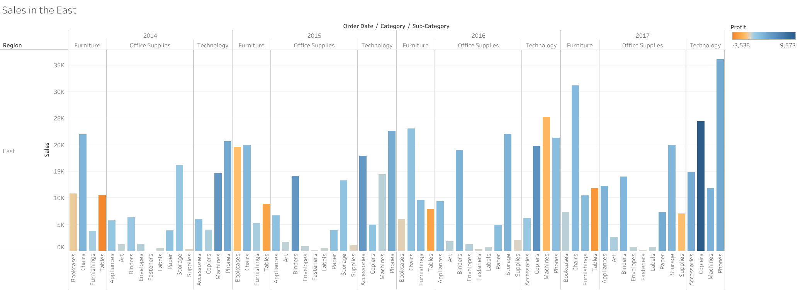
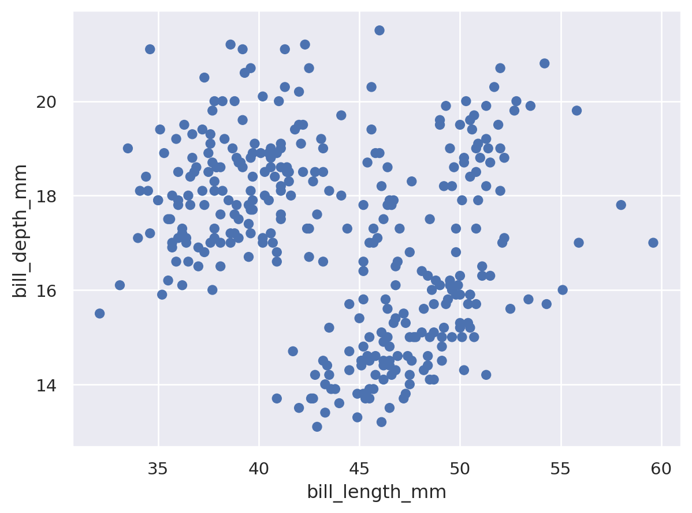
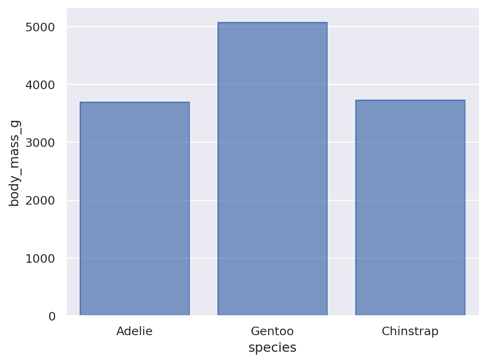

# Homework 1: Tool Setup

Stephen Harris 
CS 625, Fall 2025  
Due: September 7, 2025

## Git, GitHub

### Q1 - URL of GitHub Repo

https://github.com/sharris-tcc/CS_625_Demo.git

### Q2 - Pull Command

The "git pull" command updates the local branch using the remote branch or repository in GitHub.com.

### Q3 - Local Commits

After committing your changes you should then push your changes your remote branch or GitHub.com.  A pull request may be required if a new local branch was created

## Markdown

### Q1 - Bulleted List

* Basketball
* Football
* Baseball

### Q2 - Markdown Paragraph

** My favorite sports are *Basketball*, **Football**, and ***Baseball***.  Here is a link to the [NFL Page](https://www.nfl.com/)

### Q3 - Animal Image

## Tableau

### Q1 - Region Other Than the South

## Google Colab

### Q1 - URL of Google Colab Notebook

[Google Colab Link](https://colab.research.google.com/drive/1EC86TtaIoA-fLQZazziuiBeWtQT0-qpD?usp=sharing)

## Python/Seaborn

### Q1 - First Penguin Image

### Q2 - Second Penguin Image

### Q3 - Outer Parenthesis

The outer parenthesis allow the coder to custom format a single line of python to include spaces or multiple lines.  By removing the parenthesis the format for the line of syntax is now invalid

## Observable and Vega-Lite

### Q1 - markCircle to markSquare

The ScatterPlot changes the plots from circles to squares

### Q2 - markCircle to markPoint

The ScatterPlot changes the plots from filled circles to unfilled circles

### Q3 - Swap X and Y Axes on Scatterplot

I am able to swap x and y axes by switching the fields passed to the fieldQ functions

### Q4 - Remove fieldN(Origin)

The fieldN function adjusts the bar chart to use categories for the Origin field.  Without it all data is combined into a single row

## References

* Understanding fieldN function for Q4, <(https://observablehq.com/@observablehq/a-taste-of-observable)>
* Understanding the line breaks with parenthesis in Python, <https://www.pythonmorsels.com/breaking-long-lines-code-python/>
* Used some syntax examples for Markdown adjustments, <https://github.com/odu-cs625-datavis/public-fall25-mcw/blob/main/HW1-setup.md>
